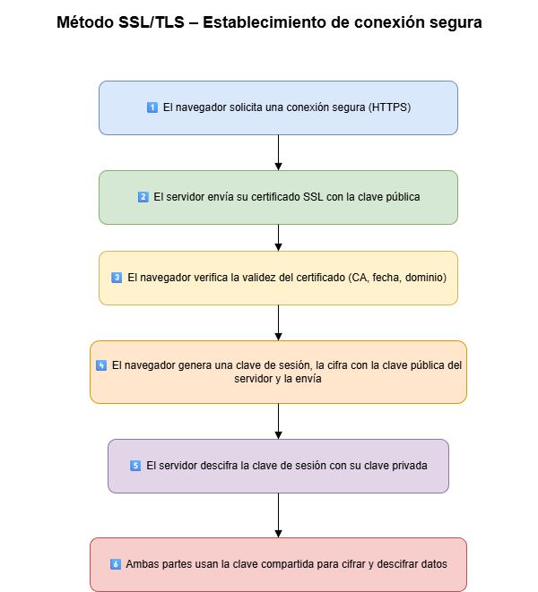
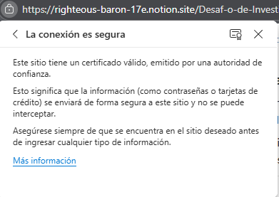

### Nombre: Brahim Gonzalez 
### Cohorte: 22


# 🔹 1. Diferencia entre HTTP y HTTPS

## Explica qué significa cada sigla

**HTTP:** *Hypertext Transfer Protocol* o *protocolo de transferencia de hipertexto*.  
Es el protocolo fundamental para la comunicación de la web y define las reglas para el intercambio de datos entre un cliente y un servidor.

**HTTPS:** *Protocolo de transferencia de hipertexto seguro*, es la versión cifrada y segura de HTTP, utilizada para proteger la comunicación entre el navegador y el sitio web. 

---

## Cifrado SSL/TLS en HTTPS

### 🔒 Cifrado SSL

#### Inicio de la conexión
1. El navegador solicita una conexión segura.  
2. El servidor responde con su certificado SSL, que contiene su clave pública y datos de identidad.

#### Verificación del certificado
- El navegador verifica que el certificado esté emitido por una autoridad confiable.  
- Si es válido, se procede; si no, se muestra una advertencia.

#### Intercambio de claves
1. El navegador genera una clave secreta temporal.  
2. Esta clave se cifra con la clave pública del servidor y se envía.  
3. El servidor la descifra con su clave privada.

#### Establecimiento del canal cifrado
- Ambas partes ahora comparten la clave secreta.  
- Se usa para cifrar y descifrar todos los datos durante la sesión.

---

### 🔐 Cifrado TLS

#### Proceso
1. El navegador solicita una conexión segura.  
2. El servidor responde con su certificado digital (clave pública e identidad).  
3. El navegador verifica la validez del certificado (si no lo es, muestra *“sitio no seguro”*).  
4. Se genera una clave secreta temporal que se cifra con la clave pública del servidor.  
5. El servidor descifra la clave con su clave privada.  
6. Ambas partes comparten una clave secreta común para cifrar la sesión.

## Diagrama de cifrado (simple)




---

## ¿Por qué HTTPS es más seguro?

El funcionamiento de HTTPS se basa en el cifrado de los datos transmitidos entre el navegador y el servidor gracias a SSL/TLS.  
Esto asegura que información sensible (como contraseñas o números de tarjetas) permanezca privada e ilegible para terceros.  
HTTP, en cambio, **no cifra los datos**, siendo vulnerable a intercepciones.

### ¿Como saber si un sitio usa HTTPS?



- podremos apreciar un candado junto a las siglas del protocolo.
- Las **autoridades de confianza** en el contexto de HTTPS son organizaciones llamadas Autoridades de Certificación que emiten certificados digitales para verificar la identidad de los sitios web.
ejemplo: `Actalis`

  📚**Fuente:** [Lista de autoridades certificadoras de confianza VISA](https://developer.visa.com/pages/trusted_certifying_authorities)
---

## ¿Qué sucede si un sitio no usa HTTPS?

Los datos se transmiten sin cifrar, exponiendo al usuario a:
- Robo de información personal  
- Suplantación de identidad  
- Ataques de *phishing*

### Ejemplo


**Solicitud HTTP normal:**
```
GET /hello.txt HTTP/1.1
User-Agent: curl/7.63.0
Host: www.example.com
Accept-Language: en
```

**Solicitud en HTTPS:**
```
t8Fw6T8UV81pQfyhDkhebbz7+oiwldr1j2gHBB3L3RFTRsQCpaSnSBZ78Vme+DpDVJPvZdZUZHpzbbcqmSW1+3xXGs
```

📚 **Fuente:** [Cloudflare – Why HTTP is not secure](https://www.cloudflare.com/es-es/learning/ssl/why-is-http-not-secure/)

---

# 🔹 2. Puertos de comunicación

## ¿Qué es un puerto y por qué es importante para HTTP?

Un **puerto** es un punto virtual donde comienzan y terminan las conexiones de red.  
Permiten que los sistemas diferencien tipos de tráfico (por ejemplo, correo electrónico, web, etc.).  
Cada puerto está asociado a un proceso o servicio específico.

📚 **Fuente:** [Cloudflare – What is a computer port?](https://www.cloudflare.com/es-es/learning/network-layer/what-is-a-computer-port/)

---

## Puertos 80 y 8080

| Puerto | Propósito | Tipo de tráfico | Uso típico | Seguridad |
|:--:|:--|:--|:--|:--|
| **80** | HTTP estándar | Sin cifrado | Navegación sin HTTPS (http://) | Vulnerable a interceptaciones |
| **8080** | Alternativa para HTTP | Sin cifrado | Servidores de desarrollo, proxies, apps locales | No reservado oficialmente por IANA |


---

➡️ HTTPS utiliza **por defecto el puerto 443**.

---

# 🔹 3. Códigos de estado de respuesta HTTP

## ¿Qué son los *status codes*?

Son los códigos que indican el resultado de una solicitud entre el navegador y el servidor.  
Permiten saber si una solicitud fue exitosa, falló o necesita más información.

---

## Tabla de clases de códigos

| Clase | Rango | Significado | Ejemplo |
|:--:|:--:|:--|:--|
| 1xx | 100–199 | 📡 Procesando: el servidor recibió la solicitud y está trabajando en ella. | Poco comunes |
| 2xx | 200–299 | ✅ Todo bien: solicitud exitosa. | `200 OK` |
| 3xx | 300–399 | 🔀 Redirección: el recurso cambió de ubicación. | `301 Moved Permanently` |
| 4xx | 400–499 | ❌ Error del cliente: la solicitud es incorrecta. | `404 Not Found` |
| 5xx | 500–599 | 💥 Error del servidor: falló al procesar la solicitud. | `500 Internal Server Error` |

---

## Códigos clave

- **`200 OK`** → Este código es importante porque nos indica que el proceso “solicitud ➡️ web ➡️ servidor ➡️ respuesta” funciona tal y como esperamos.

- **`404 Not Found`** → Este error implica que, aunque los componentes de del proceso antes mencionado se comuniquen correctamente, el contenido especifico al cual se quería acceder no fue encontrado por el servidor, lo que implica error en los datos, ya sean los ingresados o los solicitados.

- **`500 Internal Server Error`** Este error nos dice que la solicitud fue recibida por el servidor, pero hubo un error interno, por ejemplo: un error de código, una falla en la BD o una configuración incorrecta.

Entendiendo que el proceso tiene por objetivo establecer comunicación con el servidor, con la pagina web como intermediario, estos indicadores ayudan a ver que parte del proceso falló, pudiendo ver claramente donde intervenir para resolver el problema.


---

# 🔹 4. Métodos HTTP

| Método | Descripción | Ejemplo |
|:--:|:--|:--|
| **GET** | Solicita un recurso. | `GET /usuarios/123` → Obtener usuario con ID 123 |
| **POST** | Crea un nuevo recurso. | `POST /usuarios` con `{ "nombre": "Ana" }` |
| **PUT** | Actualiza o reemplaza un recurso. | `PUT /usuarios/123` con `{ "email": "nuevo@mail.com" }` |
| **DELETE** | Elimina un recurso. | `DELETE /usuarios/123` |
| **PATCH** | Modifica parcialmente un recurso. | `PATCH /usuarios/123` con `{ "email": "nuevo@mail.com" }` |
| **HEAD** | Verifica la existencia de un recurso sin descargarlo. | `HEAD /documentos/reporte.pdf` |
| **OPTIONS** | Muestra los métodos permitidos por el servidor. | `OPTIONS /usuarios` → `GET, POST, PATCH` |

**Fuente:** [Métodos de petición HTTP](https://developer.mozilla.org/es/docs/Web/HTTP/Reference/Methods)

# 🔹 5. Headers en una solicitud HTTP

## 📦 ¿Qué son los headers?

Los **headers** (cabeceras) son **metadatos** que se envían junto con una solicitud HTTP para proporcionar **contexto sobre la petición**.  
No forman parte del cuerpo del mensaje, pero influyen directamente en cómo se procesa.

---

## 📋 ¿Qué tipo de información contienen?

Algunos **headers comunes** son:

| Header | Propósito |
|:--|:--|
| **Content-Type** | Indica el tipo de contenido enviado (por ejemplo: `application/json`, `text/html`). |
| **Authorization** | Proporciona credenciales para autenticación (como `Bearer token` o `Basic`). |
| **User-Agent** | Identifica el cliente (navegador, app, etc.) que realiza la solicitud. |
| **Accept** | Especifica qué tipo de respuesta espera el cliente (por ejemplo: `application/json`). |
| **Cache-Control** | Controla cómo se almacena en caché la respuesta. |
| **Host** | Indica el dominio al que se dirige la solicitud. |

---

## 🔐 ¿Por qué son importantes al consumir APIs?

Los headers son esenciales al trabajar con **APIs RESTful**, ya que:

- Agregan una capa de seguridad permiten enviar credenciales para acceder a recursos protegidos.
- Especifican cómo se envían y reciben los datos (JSON, XML, etc.).  
- Pueden adaptar la respuesta según el cliente, idioma o tipo de dispositivo.  
- Seguridad: ayudan a validar el origen y proteger contra ataques externos

**Fuente:** [HTTP headers](https://developer.mozilla.org/es/docs/Web/HTTP/Reference/Headers)

---
## 💭Ejemplo de uso de API

`import requests`

1️⃣ Enviar solicitud GET a una API pública

`response = requests.get("https://randomuser.me/api/")`

2️⃣Convertir la respuesta a JSON (diccionario Python)

`data = response.json()`

3️⃣ Acceder a los datos

`user = data["results"][0]`
`print("Nombre:", user["name"]["first"])`
`print("País:", user["location"]["country"])`

Esto dará como resultado los valores aleatorios que en el momento de la solicitud muestre la API

---

## 5. Reflexión final
A lo largo de este trabajo repasamos los distintos componentes de los protocolos HTTP y HTTPS, ahondamos en la diferencia entre ambos, destacando la importancia de la seguridad en la comunicacion cliente - servidor. 

Entender el funcionamiento de las API es fundamental pues su funcion intermediaria está directamente ligada a los protocolos de seguridad. En el futuro al construir mis propias API tendré en cuenta la seguridad implementando los protocolos optimos, ademas de incluir headers bien configurados para asegurar la autenticación y control del contenido y en conjunto aplicar los metodos correctos.

En síntesis este conocimiento fortalece profundamente mi base tecnica al comprender la base de los procesos habituales de internet.